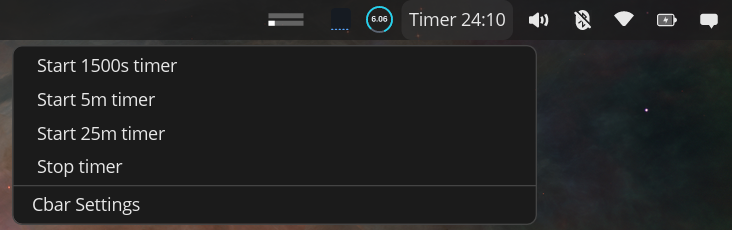
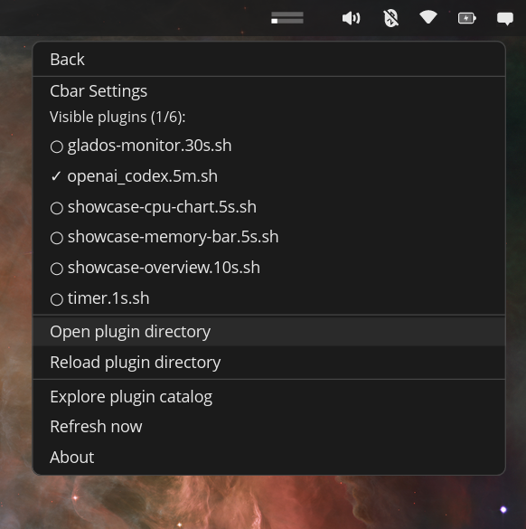
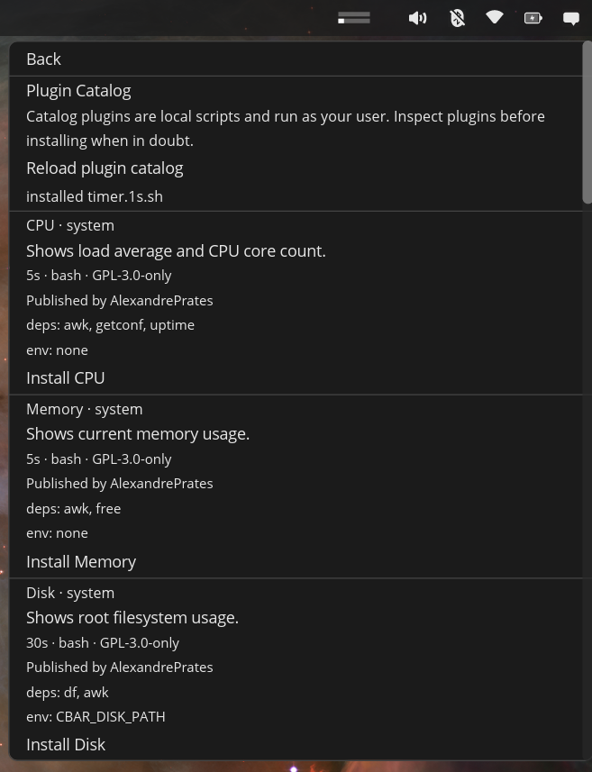

<p align="center">
  
</p>

# cbar

[](LICENSE)
[](https://www.rust-lang.org/)
[](https://system76.com/cosmic)

`cbar` is a [COSMIC](https://system76.com/cosmic) panel applet for Pop!_OS that runs local scripts and turns their output into live panel text and interactive popup actions.

It is designed for small, scriptable workflows that belong in the desktop panel:

- show status from local commands or web APIs
- open links and tools from a lightweight popup
- run shell actions without building a full desktop app
- refresh each plugin on its own interval
- keep plugin behavior transparent and easy to inspect

`cbar` is built around COSMIC and `libcosmic` applet behavior.

## Screenshots

<p align="center">
  
</p>

<p align="center">
  
  
</p>

## Quick Install on Pop!_OS

For most users, install the latest prebuilt release without compiling from source:

```bash
curl -fsSL https://raw.githubusercontent.com/alexandreprates/cbar/main/scripts/install-latest.sh | bash
```

The installer downloads the latest GitHub release and installs:

- `~/.local/bin/cbar`
- `~/.local/share/applications/io.github.alexprates.CBar.desktop`
- icons under `~/.local/share/icons/hicolor/scalable/apps/`
- showcase plugins under `~/.config/cbar/plugins/`

The applet and its plugins run as your current user. Review local plugins before enabling actions that run shell commands.

## After Installing

The desktop entry is installed with COSMIC applet metadata:

- `X-CosmicApplet=true`
- `X-CosmicHoverPopup=Auto`

If `cbar` does not appear in COSMIC applet pickers right away, log out and back in or restart the COSMIC panel/session.

You can also start the applet binary directly for a quick smoke test:

```bash
~/.local/bin/cbar
```

## Uninstall

If you installed through the release installer, clone the repository and run the uninstall script:

```bash
git clone https://github.com/alexandreprates/cbar.git
cd cbar
./scripts/uninstall-local.sh
```

The uninstall script removes the local binary, desktop entry, icons, and metainfo files from `~/.local`. It does not remove your plugin directory under `~/.config/cbar/plugins`.

## Troubleshooting

- If `~/.local/bin/cbar` does not exist, rerun the installer and check for download errors.
- If COSMIC does not list the applet, log out and back in or restart the panel/session.
- If a plugin action does not work, inspect the plugin script under `~/.config/cbar/plugins`; catalog plugins are local scripts executed as your user.
- If you want to reinstall from scratch, run `./scripts/uninstall-local.sh` from a repository checkout and then run the quick install command again.

## Status

`cbar` is currently ready for early adopters and community feedback.

It supports:

- a working `libcosmic` panel applet
- plugin discovery from a local directory
- periodic plugin execution based on filename intervals
- per-plugin parallel refresh with in-flight protection
- popup menu actions for links, shell commands, refreshes, and terminal tasks
- local installation for testing in a COSMIC session

The implementation is intentionally focused on practical COSMIC integration.

## Features

- COSMIC panel applet built with `libcosmic`
- text-based panel label composed from plugin output
- popup menu generated from plugin stdout
- per-plugin refresh scheduling
- per-plugin parallel refresh with per-plugin in-flight protection
- local plugin execution with support for shell actions, URLs, and terminal actions
- plugin catalog browsing, installation, and removal from the applet settings
- local install script for user-level testing

## Plugin Output Format

Plugins write plain text to stdout. The first visible line becomes panel text, and lines after `---` become popup entries.

Supported item syntax:

- first line as panel title
- `---` to separate panel output from popup items
- `--` for submenu depth, rendered as indentation in the popup
- `href=...`
- `shell=...` / `bash=...`
- `param1=...`, `param2=...`, ...
- `refresh=true`
- `terminal=true`
- `dropdown=false`
- `alternate=true`
- `disabled=true`
- `trim=true|false`

Notes:

- `alternate=true` is adapted for COSMIC by rendering an explicit `[alt]` entry in the popup. Modifier-key alternate entries do not map directly to this applet UI.
- nested menu items are currently rendered as indented entries, not true nested popup submenus.

## Inspiration

The plugin output format is inspired by [xbar](https://github.com/matryer/xbar), while the applet itself is designed specifically for COSMIC.

## Plugin Directory

`cbar` resolves the plugin directory in this order:

1. `CBAR_PLUGIN_DIR`
2. `./plugins` when running from the repository
3. `~/.config/cbar/plugins`

Showcase plugins are included under [plugins/](plugins/) to demonstrate panel output, popup structure, actions, environment configuration, refresh behavior, and dynamic status rows.

## Plugin Catalog

The applet settings include a plugin catalog view backed by the public [cbar-plugins](https://github.com/alexandreprates/cbar-plugins) repository.

Catalog installation downloads the selected plugin script into the active plugin directory, validates the published SHA-256 checksum, marks the file executable, and reloads the plugin list. Installed catalog plugins can also be removed from the same catalog view. Catalog plugins are local scripts and run as the current user.

By default, `cbar` loads:

```text
https://raw.githubusercontent.com/alexandreprates/cbar-plugins/main/registry/plugins.json
```

To test another registry:

```bash
CBAR_PLUGIN_REGISTRY_URL="https://example.com/plugins.json" cargo run
```

## Example Plugin

```bash
#!/usr/bin/env bash

echo "Workday"
echo "---"
echo "Open dashboard | href=https://example.com"
echo "Run sync | bash=/bin/bash param1=-lc param2='echo syncing...' refresh=true"
echo "Open terminal task | bash=/bin/bash param1=-lc param2='htop' terminal=true"
echo "Hidden helper | dropdown=false"
echo "Disabled item | disabled=true"
```

Additional examples:

- [plugins/showcase-overview.10s.sh](plugins/showcase-overview.10s.sh) demonstrates panel titles, cycle items, popup rows, nesting, alternates, hidden rows, disabled rows, and refresh.
- [plugins/showcase-actions.30s.sh](plugins/showcase-actions.30s.sh) demonstrates links, shell actions, terminal actions, and refresh-after-action.
- [plugins/showcase-config.1m.sh](plugins/showcase-config.1m.sh) demonstrates environment-variable driven plugin behavior.
- [plugins/showcase-memory-bar.5s.sh](plugins/showcase-memory-bar.5s.sh) demonstrates inline SVG images with a RAM usage bar.
- [plugins/showcase-cpu-chart.5s.sh](plugins/showcase-cpu-chart.5s.sh) demonstrates inline SVG images with a tiny CPU usage history chart.
- [plugins/showcase-status.5s.sh](plugins/showcase-status.5s.sh) demonstrates dynamic local status, thresholds, separators, and diagnostics.

## Installing from a GitHub Release

The quick install command is the recommended release path. If you prefer a repository checkout, clone with HTTPS and let the installer resolve the latest published release automatically:

```bash
git clone https://github.com/alexandreprates/cbar.git
cd cbar
./scripts/install-from-release.sh
```

If you already downloaded a release archive, you can still pass it explicitly:

```bash
git clone https://github.com/alexandreprates/cbar.git
cd cbar

version="v1.4.1"
archive="cbar-${version}-x86_64-unknown-linux-gnu.tar.gz"

curl -LO "https://github.com/alexandreprates/cbar/releases/download/${version}/${archive}"
./scripts/install-from-release.sh "./${archive}"
```

The script also accepts the archive path through `CBAR_RELEASE_ARCHIVE`:

```bash
CBAR_RELEASE_ARCHIVE=./cbar-v1.4.1-x86_64-unknown-linux-gnu.tar.gz ./scripts/install-from-release.sh
```

Without an explicit archive path, `scripts/install-from-release.sh` first looks for exactly one local `cbar-*-x86_64-unknown-linux-gnu.tar.gz` file in the repository root. If none is available, it queries the latest GitHub release, resolves the current tag, and downloads the matching versioned archive automatically.

The installer reuses the desktop entry and icons from the repository and installs:

- `~/.local/bin/cbar`
- `~/.local/share/applications/io.github.alexprates.CBar.desktop`
- icons under `~/.local/share/icons/hicolor/scalable/apps/`
- the overview showcase plugin in `~/.config/cbar/plugins/` if it does not already exist

If you prefer a direct installation from GitHub without cloning the repository first, use the quick install command:

```bash
curl -fsSL https://raw.githubusercontent.com/alexandreprates/cbar/main/scripts/install-latest.sh | bash
```

The remote installer resolves the latest published release automatically, installs the binary and desktop assets under `~/.local`, creates `~/.config/cbar/plugins`, and copies the showcase plugins that exist for that tagged release.

If the archive is placed in the repository root, the repository installer can autodetect it as well:

```bash
./scripts/install-from-release.sh
```

## Development Setup

System dependencies commonly needed for local development on Pop!_OS:

```bash
sudo apt update
sudo apt install -y cmake just libexpat1-dev libfontconfig-dev libfreetype-dev libxkbcommon-dev pkgconf curl
```

Rust is expected to be installed through `rustup`:

```bash
curl https://sh.rustup.rs -sSf | sh
source ~/.cargo/env
```

Run from source:

```bash
source ~/.cargo/env
cargo run
```

To force a specific plugin directory:

```bash
CBAR_PLUGIN_DIR="$PWD/plugins" cargo run
```

Install a local development build into `~/.local`:

```bash
./scripts/install-local.sh
```

Equivalent `just` targets are available:

```bash
just install-local
just uninstall-local
```

## Development

Common commands:

```bash
source ~/.cargo/env
cargo fmt
cargo test
cargo clippy --all-targets --all-features -- -D warnings
```

Or via `just`:

```bash
just test
```

## Project Structure

```text
src/app.rs        COSMIC applet state, messages, popup UI, refresh orchestration
src/plugin.rs     plugin discovery, execution, action dispatch
src/parser.rs     plugin output parsing
data/             desktop entry template and icons
packaging/        Flatpak manifest for local packaging and COSMIC submission prep
scripts/          local install and uninstall scripts
plugins/          showcase plugins for development
```

## Limitations

- nested popup items are visual indentation only
- plugin discovery is static after startup
- no persistent plugin configuration UI yet
- some visual plugin item parameters are not mapped to COSMIC UI yet

## Roadmap

Implemented:

- plugin catalog browsing, installation, and removal from applet settings
- plugin directory shortcuts for manual plugin management from applet settings
- clearer settings menu grouping for installed plugins, directory actions, and general actions
- support for links, shell actions, terminal actions, refresh-after-action, alternates, hidden rows, disabled rows, and inline images
- showcase plugins covering menu structure, actions, configuration, dynamic status rows, RAM gauges, and CPU charts
- local, release-archive, and latest-release install scripts with desktop entry and icon installation
- prebuilt GitHub release archives for direct installation

Next:

- add automatic plugin directory watching
- support more visual plugin item parameters where they fit COSMIC
- improve popup hierarchy beyond visual indentation
- add richer persistent configuration for individual plugins

## Related Projects

- [cosmic-applets](https://github.com/pop-os/cosmic-applets)
- [libcosmic](https://github.com/pop-os/libcosmic)

## License

GPL-3.0-only
